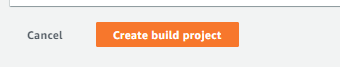

**BuildSpec Demo**

Edit
# **Getting started with AWS CodeBuild using the buildspec file.**

**Steps:**

**Step 1: Create the source code**

In order to create and deploy the build we must have the source code. We already have created source code which was uploaded on ‘[github repository](https://github.com/Tech9Apps/elevation-curb.git)’. We just need to integrate that code to the AWS code build project. 

**Step 2: Create the buildspec file**

***BuildSpec file***: A *buildspec* is a collection of build commands and related settings, in YAML format, that CodeBuild uses to run a build. Without a build spec, CodeBuild cannot successfully convert your build input into build output or locate the build output artifact in the build environment to upload to your output bucket.

Steps to create build spec file for the project

Now we already have the source code placed in the GitHub repository we just need to create the buildspec file and place it in our repository. For EC source code we are placidg this file at this path in github repository */nework/buildpec.yml*

**Step 3: Create the build project**

For creating Build Project follow the screenshots below.

1. From your AWS search function search for codebuild

1. Select Build Projects
1. Select Create Proejct

1. Give Project Name , Description as per the image below.

1. Select **Source Provider** as **‘Github’** from the drop down list
1. Select **Repository in my GitHub account** under Repository.
1. Select **Connect with a GitHub personal access token.**
1. Select **Generate github personal  access  token** and Save it.

Note: To generate the personal access token [follow this link](https://docs.github.com/en/enterprise-server@3.4/authentication/keeping-your-account-and-data-secure/creating-a-personal-access-token).

1. After saving the token select the appropriate repository from the Github repository. In our case its ‘**elevation-curb’**
1. Put the **branch name** under Source Version.  In our case we are entering branch i.e **codebuild-test.**

1. Under  **Primary source webhook events** section select the options as below

**11.1 Webhook**: Check Rebuild every time a code change is pushed to this repository

**11.2 Build Type:** Single Build

**11.3 Event Type:** PUSH

**11.4 Start a build under these conditions/HEAD\_REF optional:** codebuild-test

`     `12. Under **Environment** section select the options as below

**12.1 Environment Image**: Managed Image

**12.2  Operating System**: Ubuntu

**12.3 Runtime**: Standard

**12.4 Image:** aws/codebuild/standard:6.0

**12.5 Image Version:** Always use the Lates Image for this runtime version

**12.6 Environment Type:** Linux

**12.7 Service Role:** New Service Role

***Note**: When you select New service role it will automatically appear under ‘Role Name’ field.*

.

`      `13.  Under **Buildpec** section select the options as below

`            `13.1 Build Specfications select ‘Use a buildspec file

`     `13.2 Buildspec Name: buildspec/buildspec.yml   

\14. At the very  bottom Click on Create build Project button 

**We are done with configuring the build project. Now its time to actually build the project.** 

**Steps:** 

There are two ways of triggering the build 

1. From Aws code build console. 
1. By pushing the code to the github repository.

1.Lets see how we can trigger build from the AWS code build console.

1. `   `Navigate to the **Aws code build**
1. `   `Expand **Build section**
1. `   `Select Build Projects > Choose project name
1. `   `Click on ‘Start Button’ at the top right hand corner.

\2. Push the code to the github repo on **‘codebuild-test’** branch it will automatically trigger the build since we have configured this in the step 11.

**Important Tips:** 

You can track the build process through out the different phases from the **Phase** **details** field. 

Also, You can track the build logs from the ‘**Build Logs**’ field

**References: <https://docs.aws.amazon.com/codebuild/latest/userguide/getting-started.html>**
<https://docs.aws.amazon.com/codebuild/latest/userguide/build-spec-ref.html>

